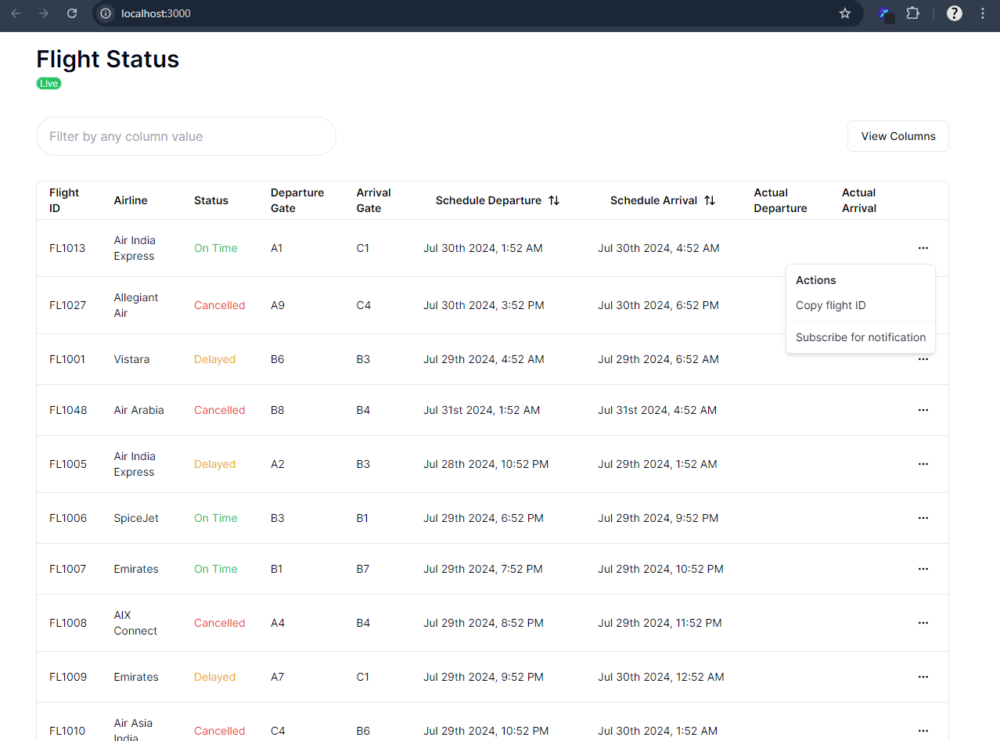
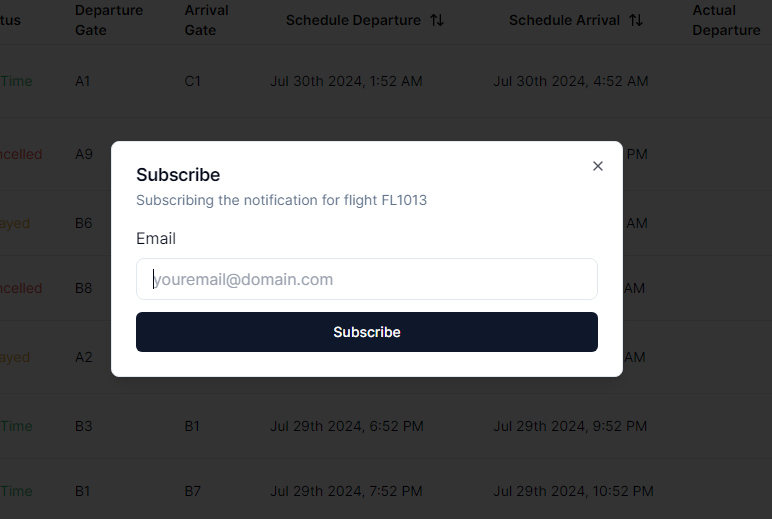
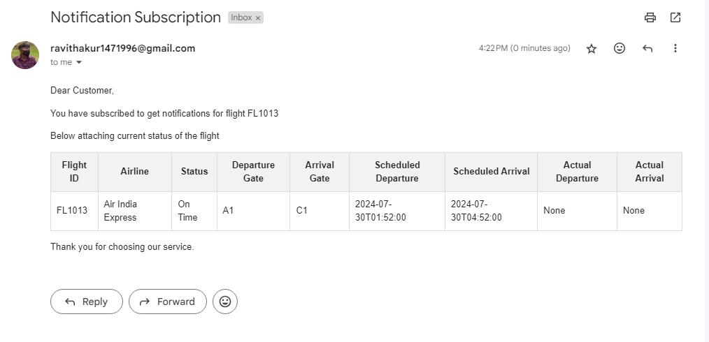
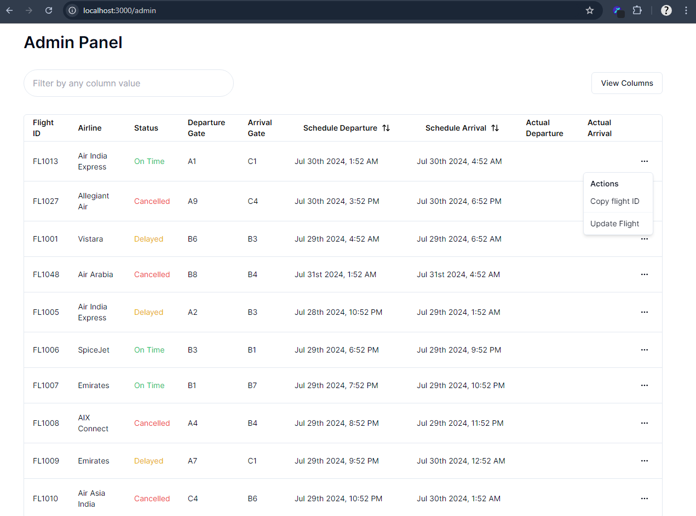
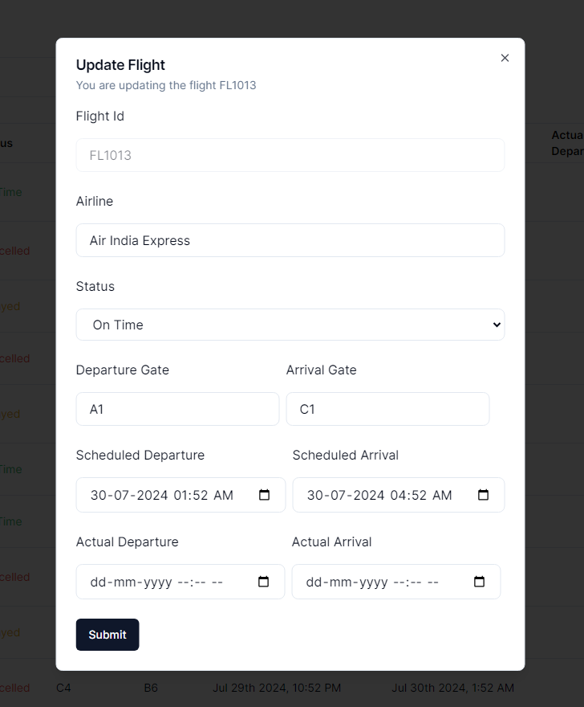
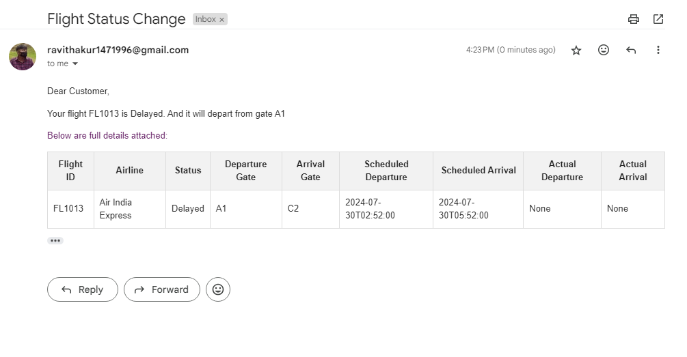

# Approach 🐱‍👓

I have created a admin dashboard to simulate the status of Flights. Once the admin changes the status of any flight, a notification reaches to each subscriber, who have subscribed for the notification of that specific flight.

### Realtime updates

Since sending realtime updates of flight is one way connection, I used [`Server-Sent Events`](https://developer.mozilla.org/en-US/docs/Web/API/Server-sent_events) to send current status of flight.

**Advantage**

- Less complex to implement
- No firewall blocking
- Builtin support of reconnection

### Notification

I used `smtp.gmail.com` email server to send email regarding flight status. I used `RabbitMq` as Message broker to process sending email and saving notification in the database in the background.
To communicate with `RabbitMq` I used the python's library called [`dramatiq`](https://dramatiq.io/), It is easy to use, reliable and provides better performance.

### Backend

To create APIs, used Python's Framework called [`FASTApi`](https://fastapi.tiangolo.com/). I chose it because of it great featuers:

- Easy to use
- Fast to code
- Great editor support
- Data validation
- Robustness

### Frontend

For frontend I used [`Next.js`](https://nextjs.org/) - The React Framework. To create beautiful UI, used [`shadcn/ui`](https://ui.shadcn.com/) a component library. We can copy paste the code and customize the components according to our needs.

### Database

For database, I used `PostgreSQL` and for Object Relation Mapping used a Python SQL Toolkit called [`SQLAlchemy`](https://www.sqlalchemy.org/), It provides a full suite of well known enterprise-level persistence patterns, designed for efficient and high-performing database access, adapted into a simple and Pythonic domain language. And for database migration used, [`alembic`](https://alembic.sqlalchemy.org/en/latest/) is a lightweight database migration tool for usage with the SQLAlchemy Database Toolkit for Python.

# 🐱‍💻 How to use code 🐱‍💻

### Clone the repository

```sh
git clone https://github.com/Thakur127/flight-status-and-notification.git
```

### Backend setup

**Note**: You should have `python 3.12` and `pip` installed in your system. As I have made this project using the specific version. If it works for you with other version then great, you are good to go.

**Change directory to Backend, use following command:**

```sh
cd backend
```

**Create virtual environment**

```sh
python -m venv [environment_name]
```

**Activate virtual environment**

```sh
[environment_name]\Scripts\activate
```

above command is for windows, for other OS you can refer this [documentation](https://docs.python.org/3/tutorial/venv.html).

**Install dependencies**

```sh
pip install -r requirements.txt
```

**Start RabbitMq Instance**

To run rabbit on your localhost you can checkout this [documentaion](https://www.rabbitmq.com/docs/install-windows).

or

Using docker, run following command-

```sh
docker pull rabbitmq:3-management
```

```sh
docker run -d --name rabbitmq -p 5672:5672 -p 15672:15672 rabbitmq:3-management
```

the above command requires [docker](https://www.docker.com/) installed on your system.

**Create Environment variables**

Create a `.env` file in your backend directory. Put required environment variables in it. Check `.env.example` for required environment variables.

**Start backend server**

run following command on your terminal

```sh
uvicorn main:app --host 127.0.0.1 --port 8000 --reload
```

**Start Consumers for sending emails and saving notification**

open another terminal, change directory to backend, then run following command

```sh
dramatiq _dramatiq.tasks
```

**Migrate changes or Create Tables in the database**

To migrate changes or create tables into the database, you can write below commands in your backend directory terminal

```sh
alembic revision --autogenerate
```

```sh
alembic upgrade head
```

**Populate data for testing**

For testing the application you can populate your database, with following command in your backend directory terminal

```sh
python
```

the above command opens up a python shell in terminal, now write following command to initialize flight data/populate database

```python
from testdata.add_data import initialize_flights
initialize_flights()
```

Now your backend setup is complete 😃

### Frontend setup

**Note**: Your system should have `node v21.7.1` and `npm 10.5.0` installed in your system. As I have created this project using specific versions, If it works for you with different version too, then you are good to go.

Open another terminal and change directory to your repository root directory

**Change Directory**

```sh
cd frontend
```

**Install dependencies**

```sh
npm install
```

**Start client server**

```sh
npm run dev
```

Once the server starts, go to the [http://localhost:3000](http://localhost:3000). And Start Enjoying application

# Reference to Website look

**First Look** 😍

Once you visit [http://localhost:3000](http://localhost:3000), you will see the following page



**Subscribe For Notification** 👍

In the right side of each row of table, yow will see three horizontal dot. Clicking on it opens up a dropdown menu, with two option -

- Copy Flight Id
- Subscribe for notification

Once you press `Subscribe for notification`, a dialogs pops up



Now put your email in input box and press Subscribe, and you will get an email like this



**Change Flight Status** 🐱‍🏍

Change your url to [http://localhost:3000/admin](http://localhost:3000/admin)



Yep, it looks same to the first page, but in dropdown menu it has different option -

- Copy Flight Id
- Update Flight

Once you click on `Update Flight`, a new dialog opens up



Once you make changes and submits it, With in a couple of seconds you will see, the most recently updated flight comes on the top of the table.

And if you have subscribed this flight for notification, you will see an email like this in your inbox



And, this whole process of sending email and saving data for notification into the database runs in the background.

Thankyou for coming this far with me 😊
